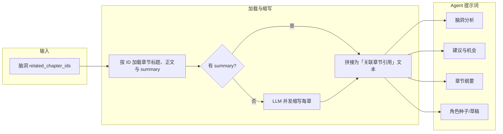

## 目标

- **后端字段启用**：确认 `brainstorm` 表的 `related_chapter_ids` 存储格式，并在服务层/接口层允许读写该字段。
- **前端编辑入口**：在脑洞新建/编辑界面中提供章节多选能力，写入 `related_chapter_ids`。
- **前端展示与筛选**：在脑洞列表 + 详情中展示关联章节，并支持按章节筛选脑洞。

## 现状梳理

- **脑洞服务端模型**：[`src/services/aiNoval/brainstormService.js`](src/services/aiNoval/brainstormService.js) 已将 `related_chapter_ids` 加入 `setValidColumns`，说明数据库字段已存在但尚未在业务里使用。
- **章节侧能力**：[`src/business/aiNoval/chapterManage/apiCalls.ts`](src/business/aiNoval/chapterManage/apiCalls.ts) 中，章节本身已有 `related_chapter_ids` 串行化/反串行化工具（`splitIds`、`splitIds2String`），并提供多种章节列表获取接口（`getChapterList`、`getChapterListFrom` 等），可以直接复用来做章节选择与展示。
- **脑洞前端列表**：[`src/business/aiNoval/brainstormManage/components/BrainstormList.tsx`](src/business/aiNoval/brainstormManage/components/BrainstormList.tsx) 当前只展示类型、状态、优先级、标题、内容摘要与分析结果摘要，没有与章节的关联展示或筛选。

## 设计方案

### 一、数据模型与接口层设计

- **1. 字段存储约定**
- **后端 MySQL**：沿用章节 `related_chapter_ids` 的做法，将其存为逗号分隔的 `varchar`/`text` 字段，如 `"1,2,5"`。
- **服务层对象字段**：在 Node 侧 `BrainstormService` 中，`createBrainstorm` / `updateBrainstorm` 接口接受的 `data.related_chapter_ids` 允许为：
  - 数字数组 `number[]`；
  - 字符串数组 `string[]`；
  - 逗号分隔字符串 `string`（透传）；
- 统一在进入数据库前转换为逗号分隔字符串，出库时原样返回，由前端负责做 `split` 转换（和章节保持一致，避免双端都做强转的混乱）。

- **2. REST API 约定**
- **创建 / 更新脑洞接口**（假设已有 `/api/aiNoval/brainstorm` POST/PUT）：
  - 请求体新增可选字段 `related_chapter_ids`：`number[] | string[] | string`。
  - 返回体中 `related_chapter_ids` 直接为字符串（保持当前 ORM 行为），或在控制器中做一次 `splitIds` 返回数组（按你现有 brainstorm 接口风格来定，此处计划保持当前风格，前端自己做适配）。
- **脑洞列表接口**：
  - 查询参数中增加：`related_chapter_id?: number`，用于“按某个章节过滤脑洞列表”。
  - SQL 条件示例（伪代码）：`AND FIND_IN_SET(?, related_chapter_ids)`。

### 二、前端章节多选交互（脑洞编辑页）

- **1. 入口位置**
- 在脑洞编辑表单组件（例如 `[src/business/aiNoval/brainstormManage/components/BrainstormForm.tsx]` 或等价文件，需在实现时定位）中，新增一个表单项：
  - 标签：**关联章节**。
  - 组件：`<Select mode="multiple" />` 或 `<TreeSelect multiple />`，数据源为该小说下的章节列表。

- **2. 章节数据源获取**
- 复用 `[src/business/aiNoval/chapterManage/apiCalls.ts]` 中的 `getChapterList(novelId)`：
  - 通过当前脑洞所隶属的 `novel_id` 或上层 `worldview_id → novelId` 获取当前作品章节列表。
  - 只拉取 `base` 数据，保证接口轻量。
- 在脑洞管理上层容器组件中（如 `BrainstormManagePage`）在加载脑洞列表同时加载一次该小说的章节列表，缓存在 `Context` 或局部状态中，供编辑表单与列表展示共用。

- **3. Select 显示与值结构**
- Select 的 `options`：
  - `value`: `chapter.id`（number）。
  - `label`: `"第 X 章 · 标题"`（从 `IChapter` 的章节号和标题拼出来）。
- 表单内部字段：`related_chapter_ids: number[]`。
- **提交前转换**：提交创建/更新脑洞时，将 `number[]` 传给 API，后端统一转成逗号分隔字符串。

### 三、脑洞列表与详情中的展示

- **1. 列表展示（`BrainstormList.tsx`）**
- 在每个脑洞卡片中，分析摘要区域下方或标签区域下方，新增“关联章节”展示：
  - 显示为多个 `Tag`，内容同样为 `"第 X 章 · 标题"`。
  - 每个 Tag 可点击，点击后：
  - 打开章节管理页面并跳转到对应章节详情（通过路由参数传 `chapterId`）。
  - 或在右侧/新抽屉中打开章节简要信息（根据你当前章节管理 UI 习惯选择，其后续实现时再定）。
- 数据获取：
  - 通过 `related_chapter_ids`（前端在拉取脑洞列表后先 `split` 成 `number[]`）从缓存的章节列表 Map（`chapterId → chapterInfo`）中查找标题与编号。

- **2. 详情展示**
- 若有单独的脑洞详情/编辑侧边抽屉组件：
  - 在详情信息部分增加“关联章节”区域，展示方式同列表（支持点击跳转）。

### 四、按章节筛选脑洞

- **1. 筛选入口 UI**
- 在脑洞列表页顶部已有的过滤区域（按类型、状态、优先级等）旁边，新增一个筛选控件：
  - 标签：**按章节筛选**。
  - 组件：`<Select allowClear showSearch />` 单选即可（你当前选择的是“过滤”而非统计多选）。

- **2. 筛选行为**
- 用户选择某个章节：
  - 更新列表查询参数 `related_chapter_id = chapterId`。
  - 触发重新请求脑洞列表接口。
- 用户清空筛选：
  - 去掉 `related_chapter_id` 参数，恢复默认列表。

- **3. 前端降级过滤（可选）**
- 若后端暂时不支持 `FIND_IN_SET` 查询，也可以先在前端做降级：
  - 拉取当前筛选条件下所有脑洞（不按章节过滤）。
  - 在前端 `filter`：`brainstorm.related_chapter_ids.includes(chapterId)`。
- 后续再补 `related_chapter_id` 查询参数与 SQL 条件，实现真正的服务端筛选。

### 五、与章节管理的协同（后续可选增强）

- **双向可见性（非本次必做，仅为扩展方向）**
- 在章节详情页中增加“关联脑洞”列表：
  - 通过调用“按章节筛选脑洞接口”获取所有 `related_chapter_ids` 包含当前章节的脑洞列表。
  - 展示脑洞标题、类型、状态，并支持点击跳转到脑洞编辑页。
- 在章节编辑时，可以一键“新建脑洞并自动关联当前章节”，简化使用流程。

---

## 六、剧情分析相关 AI Agent 使用 related_chapter_ids

### 目标

在以下四个能力中，允许传入脑洞的 `related_chapter_ids`，用其加载对应章节的标题与正文，经 LLM 并发缩写后，将缩写结果注入到各 Agent 的提示词中，作为分析的引用依据：

1. **脑洞合理性分析**（影响分析、一致性检查、风险 + 建议与机会）— [`pages/api/web/aiNoval/brainstorm/analyze.ts`](pages/api/web/aiNoval/brainstorm/analyze.ts)
2. **建议与机会**（同上 analyze 的第二段）
3. **章节生成**（章节纲要）— [`pages/api/web/aiNoval/brainstorm/generateChapterOutline.ts`](pages/api/web/aiNoval/brainstorm/generateChapterOutline.ts)
4. **角色生成**（角色种子 + 角色草稿）— [`pages/api/web/aiNoval/brainstorm/roleSeeds/generate.ts`](pages/api/web/aiNoval/brainstorm/roleSeeds/generate.ts)、[`pages/api/web/aiNoval/brainstorm/roleDrafts/generate.ts`](pages/api/web/aiNoval/brainstorm/roleDrafts/generate.ts)

### 数据流概览

### 1. 后端：统一「加载 + 缩写」能力

- **位置**：新增服务端工具函数（例如 `src/utils/aiNoval/relatedChapterContext.ts` 或放在现有 utils 下），供上述 API 路由直接调用。
- **输入**：`chapterIds: number[]`，可选 `stripTargetLength: number`（默认如 300 字）。
- **逻辑**：

  1. 使用 **ChaptersService**（[`src/services/aiNoval/chaptersService.js`](src/services/aiNoval/chaptersService.js)）按 ID 逐个查询章节：`queryOne({ id })`，得到 `title`、`chapter_number`、`content`、`summary`（若有）。
  2. 过滤掉无 `content` 或 `content` 为空的章节（若仅有 `summary` 无正文，仍可参与拼接，以 summary 作为引用内容）。
  3. 对每章决定缩写来源：**若章节已有 `summary` 字段且非空，则直接使用 `summary`，不再调用 LLM**；否则**并发**对正文调用 LLM 缩写：复用与 [`pages/api/web/aiNoval/llm/once/stripParagraph.ts`](pages/api/web/aiNoval/llm/once/stripParagraph.ts) 相同的逻辑（将 `stripParagraph(paragraph, targetLength)` 抽成可被 Node 调用的函数，或在 utils 内实现一份相同的 DeepSeek + PromptTemplate 缩写），得到每章的缩写文本。
  4. 按章节顺序拼接为一段固定格式的引用文本，例如：

     - `【关联章节引用】\n【第 X 章 标题】\n{缩写内容}\n\n【第 Y 章 标题】\n{缩写内容}`
- **输出**：`Promise<string>`，若无有效章节或全部失败则返回空字符串 `""`；并发时注意控制并发数（如 3–5）和超时，避免单次请求过长。

**与现有实现的对应关系**：

- 前端 [GenChapterByDetailModal](src/business/aiNoval/chapterManage/components/GenChapterByDetailModal.tsx) 已实现「按 related_chapter_ids 拉章 + stripText 缩写」用于章节续写的前情；本方案在**服务端**实现同等能力，供 API 使用，不依赖前端或 Dify 的 strip 接口（优先使用与 `stripParagraph` 一致的 LLM 缩写，保证可复用在无 Dify 环境）。

### 2. 脑洞合理性分析（analyze.ts）

- **入口**：在 ReAct 第一段与第二段（建议与机会）中，若 `parsedBrainstorm.related_chapter_ids` 存在且为非空数组，则先调用上述工具得到 `relatedChaptersContext: string`。
- **注入位置**：
  - **第一段（影响分析、一致性检查、风险）**：在 `userQuery` 中增加一块，例如在「脑洞内容」之后增加：
    - `relatedChaptersContext ? "\n\n【以下为关联章节缩写，供分析时对照剧情与设定】\n" + relatedChaptersContext : ""`
  - **第二段（建议与机会）**：在 `generateSuggestionsAndOpportunitiesText` 的 `userPrompt` 中同样追加上述 `relatedChaptersContext` 块（若存在），便于建议与机会结合已有剧情。
- **兼容**：`related_chapter_ids` 为空或未传时，不请求章节、不追加内容，行为与当前一致。

### 3. 章节纲要生成（generateChapterOutline.ts）

- **入口**：在构建 `userPrompt` 之前，若 `parsedBrainstorm.related_chapter_ids` 存在且为非空数组，则调用上述工具得到 `relatedChaptersContext`。
- **注入位置**：在 `userPrompt` 的「内容 / 剧情规划 / 分析结果」等现有块之后，增加：
  - `relatedChaptersContext ? "\n\n【关联章节缩写（写作时可参考的已有剧情）】\n" + relatedChaptersContext : ""`
- **兼容**：无 `related_chapter_ids` 时不追加，与当前行为一致。

### 4. 角色种子生成（roleSeeds/generate.ts）

- **入口**：在调用 `executeReAct` 之前，若 `parsed.related_chapter_ids` 存在且为非空数组，则调用上述工具得到 `relatedChaptersContext`。
- **注入位置**：在 `userQuery` 的「脑洞信息」之后（或与脑洞信息合并）增加：
  - `relatedChaptersContext ? "\n\n【关联章节缩写（角色需与已有剧情兼容）】\n" + relatedChaptersContext : ""`
- **兼容**：无关联章节时不追加。

### 5. 角色草稿生成（roleDrafts/generate.ts）

- **入口**：在构建 ReAct 的 userQuery 以及后续生成角色卡片的上下文中，若 `parsed.related_chapter_ids` 存在且为非空数组，则调用上述工具得到 `relatedChaptersContext`。
- **注入位置**：在传入「脑洞信息」或「世界观摘要」的同一处上下文中追加上述关联章节引用块。
- **兼容**：无关联章节时不追加。

### 6. 实施要点（本段）

- **优先使用 summary**：加载章节时若已有 `summary` 字段且非空，直接使用，不调用 LLM 缩写，节省成本与延迟；仅当无 summary 时才对正文做 LLM 缩写。
- **复用 LLM 缩写**：后端统一使用与 `stripParagraph` 一致的 DeepSeek 缩写逻辑（可抽到共享模块），避免依赖 Dify；若未来希望改用 Dify，可再抽象一层「strip 适配器」。
- **并发与限流**：多章并发缩写时建议限制并发数（如 3–5）和单章超时，总超时需满足上层 API 的超时（如 analyze 10 分钟）。
- **章节顺序**：拼接「关联章节引用」时按 `related_chapter_ids` 的顺序，便于与剧情顺序一致。
- **空内容与错误**：某章拉取失败或缩写失败时，可跳过该章并记录日志，其余章照常拼接；若全部失败则返回 `""`，各 Agent 不因缺少关联章节而报错。

---

## 实施要点（总）

- **字段与序列化保持一致**：
- 章节与脑洞两侧的 `related_chapter_ids` 推荐都采用“前端使用 `number[]`、接口传数组或字符串、数据库落地为逗号分隔字符串”的约定，避免不同模块不同约定导致的混乱。
- **性能考虑**：
- 章节列表通常有限（一个作品百级别），完全可以在脑洞管理页面初始化时一次性拉取并缓存，不必为每条脑洞单独拉章节接口。
- **兼容老数据**：
- 老脑洞记录 `related_chapter_ids` 为空/不存在时，前端统一视为 `[]`，不展示章节 Tag，不影响现有功能。