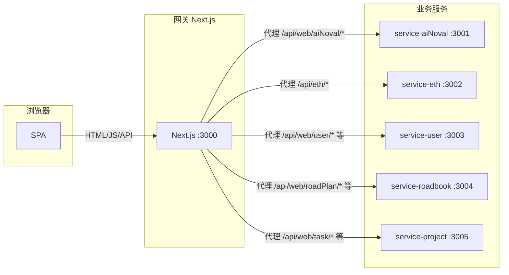

# Next.js 微服务拆分方案（路由服务 + 业务服务）

## 当前架构简要

- **单体**：一个 Next.js 16 应用，App Router 下 `app/[[...slug]]` 承接所有前端路由，渲染一个 SPA（[`app/spa-page.tsx`](app/spa-page.tsx) + [`src/router`](src/router) + React Router）。
- **API**：`app/api/[[...path]]/route.ts` 通过生成的 [pagesApiHandlerMap](src/lib/pagesApiHandlerMap.generated.ts) 将请求分发到 `pages/api` 下 150+ 个 handler；已有 [rewrites](next.config.js)（如 `/api/:path*` → `/api/web/:path*`）。
- **业务域**：从路由与 API 可归纳为：**aiNoval**（体量最大）、**eth**、**user**（含 permission/role/account）、**roadbook**、**projectManage**（task/bug/employee/weekReport 等）、**bike**、**devTools**、**dashboard**、**mcp**、**app**（登录/initdata）等。
- **已有基础**：已使用 qiankun 接入 b2c_scrapy 微前端；中间件 [proxy.ts](proxy.ts) 做鉴权与 `/app` 拦截。

前端请求均为**相对路径**（如 `fetch.get('/api/user/role/list')`），无 baseURL，因此只要网关统一入口并做反向代理，浏览器侧无需改 URL。

---

## 目标架构



- **网关（路由服务）**：唯一对公网暴露的 Next.js，负责：静态资源与 SPA、鉴权中间件、**将 /api 按路径前缀反向代理到对应业务服务**。
- **业务服务**：多个 Next.js 应用，每个只承载一个或少量业务域的 **API**（以及可选地该域的 SSR 页面）；不直接对外，仅被网关或内网调用。

---

## 技术选型要点

| 维度 | 建议 |

|------|------|

| 仓库结构 | **Monorepo**（如 pnpm workspace + Turborepo），便于共享类型、工具和渐进迁移。 |

| 网关代理实现 | Next.js `rewrites` 只能同机转发到 path，**不能**直接 rewrite 到另一台机的 URL。因此需在网关内用 **API Route 做 HTTP 代理**（如 `app/api/proxy/[...path]/route.ts` 内请求下游服务并返回），或使用 **Nginx/Traefik** 等做反向代理。若希望全部用 Next.js，则网关保留「代理用 API Route + 一层 rewrites 把 /api/xxx 转到 /api/proxy/xxx」即可。 |

| 服务发现/配置 | 首版可用 **环境变量** 配置各业务服务 base URL（如 `SERVICE_AINOVAL_URL=http://localhost:3001`），网关按前缀选 URL 做 proxy。 |

| 共享代码 | 抽到 `packages/shared`（或 `shared-types`、`shared-config`）：请求客户端、通用类型、权限/登录相关工具等；各业务服务只依赖 shared，不互相依赖。 |

| 数据与依赖 | 各服务独立连接 MySQL/Chroma/RabbitMQ 等（按需连接），或保留一个「数据服务」由网关/部分服务调用；需统一 **鉴权**（如 JWT 或 Session 由网关校验后转发 header，或各服务校验同一 token）。 |

---

## 拆分策略（按业务域）

建议按 **API 路径前缀** 与 **已有业务目录** 对齐，先拆「体量大、边界清晰」的域，再收口剩余 API：

1. **service-aiNoval**：`/api/web/aiNoval/*`、以及 aiNoval 强依赖的 `/api/web/chroma/*`、`/api/web/rabbitmq/queue` 等（若希望 aiNoval 自治）。
2. **service-eth**：`/api/eth/*`。
3. **service-user**：`/api/web/user/*`、`/api/web/my-account/*`（与 [proxy.ts](proxy.ts) 中 app 鉴权可继续在网关做）。
4. **service-roadbook**：`/api/web/roadPlan/*`、路书相关。
5. **service-project**：`/api/web/task/*`、`/api/web/employee/*`、`/api/web/bug/*`、`/api/web/weekReport/*`、`/api/web/fuckCheck/*`、`/api/web/interact/*`、`/api/web/dashboard` 等。
6. **网关保留**：`/api/app/*`（登录、initdata）、`/api/mcp/*`、以及未拆出的零散 API（或暂时全部保留在网关，仅把已拆出的做代理）。

前端 SPA 仍全部放在**网关**：现有 `src/framework`、`src/router`、`src/business` 保留在网关项目内，通过网关的代理访问上述各服务，**前端代码无需改请求路径**。

---

## 前端路由层的处理方式

当前前端是**单 SPA**：App 层用 `app/[[...slug]]` 接住所有路径，页面内用 [React Router](src/router/index.tsx) + [MainFrame](src/framework/index.tsx) 做布局与子路由（taskManage、roadBook、novel、eth、user 等），菜单来自权限接口、与路由 path 对应。微服务拆分后，路由层可以有以下三种处理方式。

### 方案一：网关单 SPA，路由层保持不变（推荐首期）

- **做法**：网关继续承载整站 SPA，现有 [src/router](src/router/index.tsx) 和 [MainFrame](src/framework/index.tsx) 原样保留；所有业务页仍以 `<Route path="novel/xxx" element={<AiNovalXxx />} />` 等形式挂在同一棵 React Router 下，仅后端 API 按前缀代理到不同服务。
- **优点**：零路由改动、菜单/权限/布局逻辑不用动、与当前「只拆 API」的目标一致；首期只做网关代理即可。
- **缺点**：所有业务 UI 仍在网关一个仓库里，前端未按域物理拆分。
- **适用**：先解决「后端屎山」、前端暂时保持现状时。

### 方案二：网关壳 + 按域微前端（qiankun），路由分两层

- **做法**：
  - **壳路由（网关）**：网关的 React Router 只保留少量顶层路由，例如 `/`（主壳）、`/login`、`/novel/*`（小说子应用）、`/eth/*`（ETH 子应用）、`/taskManage/*`（敏捷子应用）等；其中 `/novel/*`、`/eth/*` 等每条对应一个 **qiankun 子应用容器**（你已有 [MicroAppContainer](src/components/micro-frontend/MicroAppContainer.tsx) 与 b2c_scrapy 实践）。
  - **子应用内路由**：每个业务服务（或单独部署的 SPA）自带 React Router，只负责本域路由（如 novel 内部 `/novel/NovalManage`、`/novel/worldViewManage`…），通过 qiankun 的 `activeRule` 与网关约定好 path 前缀即可。
- **路由分工**：
  - 网关：`BrowserRouter` 下只有 `Route path="/" element={<MainFrame />}`，MainFrame 内根据 `location.pathname` 判断：若匹配 `/novel/*` 则渲染 `<MicroAppContainer name="novel" entry="..." activeRule="/novel" />`，其余仍渲染现有 `<Outlet />` + 侧栏菜单（或菜单里「小说」点击后跳转 `/novel/...` 由 qiankun 接管）。
  - 子应用：独立 React Router，base 为 `/novel`，内部路由与现有 `novel/*` 一致；子应用打包时配置 `publicPath` 与网关约定，保证资源加载正确。
- **优点**：前端按域拆成多应用、可独立发版；与现有 qiankun 能力一致，只扩展更多子应用。
- **缺点**：需维护主壳与各子应用的路由约定、菜单/权限可能要从主壳下发或子应用自拉；首屏与子应用加载略复杂。
- **适用**：希望「前端也按业务域拆分」、多团队并行开发时。

### 方案三：按域多 SPA，网关只做路由分配（重定向/iframe）

- **做法**：网关不再跑整站 SPA，只提供入口页和「路由分配」：根据 path 做 302 重定向到不同前端应用（如 `https://novel-app.example.com`、`https://eth-app.example.com`），或网关页内用 iframe 按 path 加载不同 origin 的页面。
- **优点**：各域前端完全独立部署、技术栈可异构。
- **缺点**：整站不再共享同一布局/菜单/登录态（需 SSO 或 token 传递）；用户体验与当前单 SPA 差异大，改造成本高。
- **适用**：多产品线、多团队且希望彻底隔离时；一般在你当前场景下不优先。

---

**小结**：首期建议采用**方案一**，路由层不动，只做 API 微服务拆分；若后续希望前端也按域拆分，再在网关引入**方案二**，把部分域（如 novel、eth）从现有 `src/router` 里迁出为 qiankun 子应用，主壳只保留「壳路由 + 子应用容器」与未拆分的业务路由。

---

## 实施步骤（概要）

1. **搭建 Monorepo**

   - 根目录 `pnpm-workspace.yaml` 或 npm workspaces，`packages/shared`、`apps/gateway`、`apps/service-aiNoval` 等。
   - 当前仓库内容迁入 `apps/gateway`（或先 `apps/monolith` 再重命名），保证现有 dev/build 仍可用。

2. **抽取共享层**

   - 将 `src/fetch`、`src/store`（或仅类型）、`src/config` 中与业务无关部分、鉴权/登录相关工具抽到 `packages/shared`，供网关与各 service 使用。
   - 各业务服务若需 MySQL/Chroma/RabbitMQ，可在 shared 中提供「配置 + 连接工厂」，或各自拷贝最小配置（首版可拷贝，后续再收口）。

3. **实现网关代理**

   - 在网关新增 `app/api/proxy/[...path]/route.ts`（或按前缀拆多个 route）：根据 `path` 判断目标服务（如 `web/aiNoval` → SERVICE_AINOVAL_URL），转发请求体、headers（含 Cookie/Authorization）、method，并返回下游响应。
   - 网关 `next.config.js` 的 rewrites：将需要转发的前缀（如 `/api/web/aiNoval`）指向 `/api/proxy/web/aiNoval`，这样现有前端仍请求 `/api/web/aiNoval/...`，实际由网关转发到 service-aiNoval。

4. **创建第一个业务服务（如 service-aiNoval）**

   - 新建 `apps/service-aiNoval`：Next.js 项目，仅保留 `pages/api/web/aiNoval`、`pages/api/web/chroma` 等必要 API 与 shared 依赖；配置 `basePath: ''` 或与网关约定一致路径（如服务内仍为 `/api/web/aiNoval/...`），这样网关转发时 path 与 query 可原样传递。
   - 从当前仓库移走（或复制）对应 `pages/api` 下的 handler 与依赖到 service-aiNoval，并接入 shared 的配置/鉴权（若需校验 token，可从 header 读取网关转发的信息）。

5. **网关关闭已拆分 API 的本地处理**

   - 网关的 `pages/api` 中，已转发到 service-aiNoval 的路径可删除或改为「仅开发时 fallback」；生成脚本 `generate-pages-api-map.js` 只扫描网关仍保留的 API，避免重复注册。

6. **重复 4～5 步**

   - 按序落地 service-eth、service-user、service-roadbook、service-project；每步都保持网关 rewrites + proxy 指向新服务，并收缩网关内对应 API。

7. **鉴权与 Cookie**

   - 方案 A：网关中间件校验 Session/JWT，代理时在 header 中带 `X-User-Id` 等，业务服务信任该 header（仅内网可访问时可行）。
   - 方案 B：网关代理时转发 Cookie，业务服务使用同一 Session 存储（如 Redis）校验。建议首版采用 A，减少各服务对 Session 的依赖。

8. **部署与运行**

   - 开发：同时跑网关（3000）与各 service（3001、3002…），通过 env 配置各 `SERVICE_*_URL`。
   - 生产：网关与各服务独立部署（Docker/K8s），网关通过内网 URL 调用各服务；如需，可在网关前再加 Nginx 做 TLS/限流。

---

## 风险与取舍

- **复杂度**：从「单进程」变为「多进程 + 代理 + 共享包」，调试与排错成本增加；建议先拆 1～2 个域（如 aiNoval + eth）验证再铺开。
- **共享依赖**：若 shared 抽得过多，可能导致网关与各服务强耦合；若抽得过少，则重复代码多。折中：先只抽「请求客户端、通用类型、鉴权工具」，各服务保留自己的 config 与 DB 访问。
- **Next.js 限制**：rewrites 不能直接写「转发到 http://其他主机」，所以必须用 API Route 做一层 HTTP 代理，或使用外部反向代理（Nginx/Traefik）。
- **可选**：若希望「业务服务也带 UI」，可让每个 service 拥有自己的 App Router 页面（如 `/novel/*` 在 service-aiNoval），网关通过 iframe 或 qiankun 加载；当前方案可先只拆 API，UI 仍全部在网关。

---

## 若暂不拆多进程的替代方案

若希望先「治屎山」而不立刻上多服务：

- **逻辑拆分**：保持单仓库、单 Next.js，在 `pages/api` 下严格按域分子目录（已基本如此），并约定「跨域」调用通过内部函数或 shared 的 service 层，避免 handler 互相 import 成团。
- **按域分包**：将 `src/business` 与对应 `pages/api/web/xxx` 在概念上绑定为「模块」，通过脚本或文档约束边界，为后续物理拆服务做准备。

这样可以在不增加运维复杂度的前提下，先收敛依赖与边界，再按本方案逐步拆出微服务。

---

## 建议的目录示意（Monorepo）

```
next-framework/
├── apps/
│   ├── gateway/                 # 当前单体迁入：SPA + 鉴权 + 代理 + 未拆 API
│   │   ├── app/
│   │   │   ├── api/proxy/[...path]/route.ts
│   │   │   └── ...
│   │   ├── src/
│   │   │   ├── framework, router, business, fetch, store...
│   │   └── pages/api/           # 仅保留 app, mcp 及未拆出的 web
│   ├── service-aiNoval/
│   │   ├── pages/api/web/aiNoval, chroma, rabbitmq...
│   │   └── package.json (next, @repo/shared)
│   ├── service-eth/
│   ├── service-user/
│   └── ...
├── packages/
│   └── shared/                  # 类型、fetch、鉴权工具、通用 config
├── pnpm-workspace.yaml
└── turbo.json
```

按上述步骤，即可在保留「路由服务 + 业务服务」架构的前提下，将现有 Next.js 单体拆成多微服务，并保持前端路由与 API 路径不变。