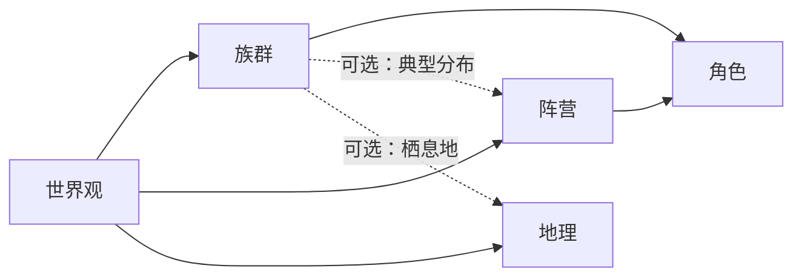

# 世界观族群设定集 — 考虑因素与实现要点

## 一、当前状态

- **[raceManage/index.tsx](src/business/aiNoval/raceManage/index.tsx)**：仅有世界观选择 + 空的「新增」按钮，无列表与编辑。
- **角色侧**：[roleInfoEditModal.tsx](src/business/aiNoval/roleManage/edit/roleInfoEditModal.tsx) 中已有 `race_id` 表单项，但种族下拉为空（`{/* TODO: 添加种族选项 */}`）。
- **类型**：[IAiNoval.ts](src/types/IAiNoval.ts) 中 `IRoleInfo` 有 `race_id`，但**没有** `IRaceData` 或任何族群实体类型。
- **后端**：项目中无 `race`/族群 相关 API（对比：faction 有 `/api/web/aiNoval/faction`、list、relation、territory 等）。

因此，族群设定集需要**从类型、API、到 raceManage 页面与角色编辑联动**整体设计。

---

## 二、需要考虑的因素

### 1. 数据模型（设定集字段）

族群是「世界观下的种族/物种」维度，建议至少包含：

| 维度 | 建议字段 | 说明 |

|------|----------|------|

| 归属 | `worldview_id` | 与世界观一致，列表/筛选按世界观 |

| 基础 | `name`, `description` | 名称、简述（与 [IFactionDefData](src/types/IAiNoval.ts) 对齐） |

| 物理/生物学 | 可选：`appearance`, `lifespan`, `traits`, `weaknesses` | 外形、寿命、特质、弱点，供生成与一致性用 |

| 文化/社会 | 可选：`naming_habit`, `customs`, `typical_faction_ids` | 命名习惯、习俗、常见所属阵营，便于与阵营、角色联动 |

| 嵌入/RAG | `embed_document`（待嵌入原文）、ChromaDB 相关存储（如 collection/doc id） | 向量库使用 **ChromaDB**；用于按族群召回 |

**亚种（树形结构）**：引入 `parent_id`（根族群为 null），与阵营一致。主种族（如「人类」「精灵」）为一级节点，亚种（如「北地人」「暗精灵」）为子节点；类型定义需包含 `parent_id`，列表接口返回平铺，前端用与 [factionManage/apiCalls.buildTree](src/business/aiNoval/factionManage/apiCalls.ts) 相同的逻辑转树。

**排序（正式要求）**：数据模型必须包含 **`order_num`**（同层展示顺序，数字越小越靠前）。列表接口按 `order_num` 排序返回；前端 buildTree 后同层节点按 `order_num` 排序展示；新建时（根或亚种）由后端或前端计算当前同层 `max(order_num)+1` 写入。

是否要「族群关系」（类似 `IFactionRelation`）取决于产品：若需要种族之间的敌对/同盟等，可单独加 `race_relation` 表与 API；首版可只做 CRUD + 树形。

### 2. 与现有模块的关系

- **世界观**：族群归属 `worldview_id`，列表/筛选以世界观为入口（与 [WorldviewSelect](src/components/aiNovel/worldviewSelect.tsx) 一致）。
- **角色**：`IRoleInfo.race_id` 已存在，需在角色编辑中接入「族群下拉」数据源（见下文 RaceSelect）。
- **阵营**：若设定集需要「该族群常见所属阵营」，可加 `typical_faction_ids` 或通过角色统计反推；首版可不做。
- **地理**：若需要「主要栖息地」，可加 `primary_geo_codes` 或与地理模块弱关联；首版可不做。

### 3. 结构：主种族 + 亚种（树形）

- **阵营**：有 `parent_id`，树形（子阵营、派系），见 [factionTree](src/business/aiNoval/factionManage/factionTree.tsx)、[apiCalls.buildTree](src/business/aiNoval/factionManage/apiCalls.ts)。
- **族群**：**需支持亚种**，采用与阵营一致的树形：主种族（如人类、精灵、兽人）为根节点（`parent_id = null`），亚种（如北地人、暗精灵）为子节点（`parent_id = 主种族 id`）。数据模型增加 `parent_id`、**`order_num`**（同层排序，必填）；API 列表按 order_num 排序返回平铺，前端 buildTree 转树；raceManage 左侧用树形展示，编辑时可选择「作为某族群的亚种」；角色编辑中的 RaceSelect 用 **TreeSelect** 展示「主种族 / 亚种」层级，选项为路径形式。

### 4. 后端 API 形态

- **API 使用 Next 最新标准的 App 形式**：族群相关接口在 **App Router** 下以 **Route Handlers**（`route.ts`）实现，路径置于 `app/api/`，与现有 [app/api/web/my-account/initdata/route.ts](app/api/web/my-account/initdata/route.ts) 风格一致。例如：`app/api/web/aiNoval/race/route.ts`（GET 单条/POST 创建或更新/DELETE）、`app/api/web/aiNoval/race/list/route.ts`（GET 列表，按 worldview_id、order_num 排序）；生成嵌入文本、投递嵌入任务可分别为 `app/api/web/aiNoval/race/embed-text/route.ts`、`app/api/web/aiNoval/race/embed-task/route.ts` 等。这些路由会优先于 [app/api/[[...path]]/route.ts](app/api/[[...path]]/route.ts) 的 catch-all 匹配，无需再走 `pages/api` 或 pagesApiHandlerMap。
- 若部分逻辑仍委托**外部服务**：在对应 Route Handler 内调用外部 API，对外仍以 `/api/web/aiNoval/race/...` 暴露。

API 建议至少：**列表（按 worldview_id，按 order_num 排序）**、**创建/更新/删除**；**嵌入**：提供「生成族群嵌入文本」接口（供前端自动生成嵌入文本并写回 `embed_document`）、以及由前端或保存时触发的「投递族群嵌入任务」；后台任务队列消费该任务后将向量写入 ChromaDB。

**删除与引用校验（正式要求）**：删除接口必须做前置校验：（1）若存在子亚种（存在 `parent_id = 当前 id` 的记录），则拒绝删除并返回明确错误（或由业务约定改为级联删除）；（2）若存在角色引用（`role_info.race_id = 当前 id`），则拒绝删除并返回错误信息（如「N 个角色使用该族群」）。前端在调用删除前可先请求「是否可删除」或直接调用删除后根据错误码/文案提示用户。

### 5. 前端实现要点

- **类型**：在 [IAiNoval.ts](src/types/IAiNoval.ts) 中新增 `IRaceData`（或 `IRaceDefData`），包含上述字段及 **`parent_id`**（亚种指向主种族）、**`order_num`**（同层排序，必填）。
- **排序（正式要求）**：前端展示族群树时，同层节点按 `order_num` 升序排列；新建根族群或亚种时，若后端未自动赋值，前端需计算同层 `max(order_num)+1` 并随提交；列表接口返回顺序需与 `order_num` 一致，buildTree 后保持该顺序。
- **亚种继承与覆盖（正式要求）**：前端在族群详情/编辑中，对亚种节点需支持「继承自主种族」的展示与编辑：展示时，若亚种未填某字段（如命名习惯、共性特质），则显示父族群的该字段并标注「继承自 XXX」；编辑时，允许仅编辑本节点覆盖的字段，未覆盖的视为继承父节点。实现方式二选一或并存：（A）展示/提交前由前端根据 parent 链 merge 父节点字段；（B）后端返回「合并后」的展示用数据，前端编辑只提交有改动的字段。角色绑定展示时，若有亚种可显示完整路径（如「人类 / 北地人」）；RaceSelect 的 TreeSelect 选项 label 使用路径形式（主种族名 / 亚种名）。
- **删除与引用校验（正式要求）**：前端在发起删除前，可根据后端删除接口的约定，先调用删除；若后端返回「存在子亚种」或「存在 N 个角色引用」等错误，前端必须拦截并提示用户（如「请先删除其下亚种」或「有 N 个角色使用该族群，请先修改角色设定」），不得在未提示的情况下静默失败。若有「检查是否可删除」的查询接口，可在点击删除时先请求再决定是否弹出确认与调用删除。
- **raceManage 页面**：参考 [factionManage](src/business/aiNoval/factionManage/index.tsx) 的布局（左：世界观 + **族群树**，右：详情）。左侧用树形组件展示主种族与亚种（按 order_num 排序），支持新增根族群、在某节点下新增亚种、编辑、删除；右侧详情与 [factionInfoPanel](src/business/aiNoval/factionManage/panels/factionInfoPanel.tsx) 类似，亚种需支持继承与覆盖的展示与编辑；并在此处提供**自动生成嵌入文本**入口（如按钮），生成后写回 `embed_document` 并可触发嵌入任务。
- **RaceSelect 组件**：新建 [RaceSelect](src/components/aiNovel/raceSelect.tsx)，按 `worldview_id` 拉取族群列表并转树（同层按 order_num 排序），使用 **TreeSelect** 展示「主种族 / 亚种」层级，选项 label 为路径形式；供 raceManage 与角色编辑使用。
- **角色编辑**：在 [roleInfoEditModal.tsx](src/business/aiNoval/roleManage/edit/roleInfoEditModal.tsx) 中，将当前空的种族下拉改为 `<RaceSelect value={...} onChange={...} />`，且需传入当前选中的 `worldview_id`（该弹窗内已有世界观选择）。

### 6. 嵌入与召回

- **向量库**：族群嵌入使用 **ChromaDB** 作为向量库（与 Dify 数据集区分或并存按现有架构而定）；族群设定写入 ChromaDB 的 collection（可按 worldview 或统一 collection + metadata 区分），用于「按族群召回」等 RAG 能力。数据模型保留 `embed_document`（待嵌入的原文）及与 Chroma 对应的存储字段（如 chroma_collection、chroma_doc_id 等，依实际集成方式定）。
- **前端：自动生成嵌入文本**：在族群详情/编辑中提供**自动生成嵌入文本**功能（如按钮「生成嵌入文本」）。前端调用后端接口，根据当前族群（含亚种继承合并后的）name、description、traits 等字段生成一段用于嵌入的 `embed_document` 文本，并写回当前族群记录；生成逻辑可参考现有 [generateFactionEmbedText](src/api/aiNovel) 等，若后端有统一「生成某类实体 embed 文本」的 LLM 接口可复用。生成完成后可触发「提交嵌入任务」（见下）。
- **后台任务队列：族群嵌入任务**：在现有**后台任务队列**中增加**处理族群嵌入任务的事件响应**：当收到「族群嵌入」类任务（如 payload 含 race_id 或 worldview_id + race_id）时，读取该族群的 `embed_document`，调用嵌入模型得到向量，将向量写入 ChromaDB（含 metadata 如 worldview_id、race_id），并可选写回「已嵌入」状态或 Chroma 文档 id 到业务库。任务可由前端在「生成嵌入文本」后发起，或由保存/发布族群时自动投递；失败时需有重试或死信策略，与现有队列约定一致。

### 6.1 嵌入与召回实现后的 DDD 领域与 MCP 工具

在嵌入与召回（ChromaDB + 生成嵌入文本 + 任务队列）实现完成后，需实现**族群相关的 DDD 领域**与 **MCP 工具**，供 API、任务与 AI 调用统一复用。

- **DDD 领域**：在 [src/domain/novel](src/domain/novel) 下增加族群（Race）领域能力，与现有 findFaction、findGeo、findRole、geoStructure 等对齐。建议包括：（1）**findRace**：按世界观 ID + 关键词或向量相似度（调用 ChromaDB 召回）查询族群，返回匹配的族群列表及相似度/片段；（2）**raceStructure**：返回指定世界观下的族群树结构（平铺转树、按 order_num 排序），供列表与结构展示复用；（3）若项目有统一的聚合/仓储分层，则增加 Race 聚合根或实体、RaceRepository 接口，由 App API 与 MCP 共同依赖领域层而非直接调库。
- **MCP 工具**：在 [src/mcp/tools](src/mcp/tools) 下新增族群相关工具，并在 [src/mcp/index.ts](src/mcp/index.ts) 中注册。建议至少：（1）**find_race**：入参 worldview_id、keywords（或 query 文本），可选 threshold；调用 findRace 领域（或 ChromaDB 召回 + 业务数据补全），返回与「按族群召回」一致的结构化结果，供 AI 检索族群设定；（2）**race_structure**：入参 worldview_id，返回该世界观下族群树（主种族/亚种层级），与现有 [faction_structure](src/mcp/tools/factionStructure.ts) 行为对齐。工具命名、入参 schema、错误处理与现有 [FindFactionTool](src/mcp/tools/findFaction.ts)、FactionStructureTool 保持一致风格。

### 7. 脑洞/角色构思中的一致性

- [IRoleDraftCard](src/types/IAiNoval.ts) 中有 `race_or_species` 字符串；若希望与设定集打通，可在「从草稿创建角色」时，通过名称匹配或下拉选择对应 `race_id`，避免重复造轮子。

---

## 三、建议实现顺序

1. **类型与 API**：在 `IAiNoval.ts` 中定义 `IRaceData`（含 `parent_id`、`order_num`）。API 使用 **Next App Router** 形式在 `app/api/web/aiNoval/race/` 下实现 Route Handlers（list、CRUD 等）；list 按 order_num 排序，删除接口实现「存在子亚种或角色引用时拒绝并返回明确错误」；前端 list 后用 buildTree 转树，同层按 order_num 展示。
2. **RaceSelect（TreeSelect）**：按 `worldview_id` 拉取列表并转树（按 order_num 排序），以 TreeSelect 展示主种族/亚种层级，选项 label 为路径形式；供 raceManage 与角色编辑使用。
3. **raceManage 页面**：世界观 + **族群树**（左，按 order_num 排序）+ 新增根/新增亚种/编辑/删除；右侧详情与编辑支持**亚种继承与覆盖**（展示继承、编辑覆盖）；删除时调用后端并**根据错误提示用户**（子亚种、角色引用）。
4. **角色编辑**：在 roleInfoEditModal 中接入 RaceSelect（TreeSelect），保证 `race_id` 可选到具体亚种；角色详情/列表中种族展示为路径形式（如「人类 / 北地人」）。
5. **嵌入与召回**：向量库使用 **ChromaDB**；前端族群详情提供「自动生成嵌入文本」并写回；后台任务队列增加**族群嵌入任务**的事件响应（读取 embed_document → 调用嵌入模型 → 写入 ChromaDB）；API 以 **App Router** 形式在 `app/api/web/aiNoval/race/...` 下提供 list、CRUD、生成嵌入文本、投递嵌入任务等接口。
6. **DDD 领域与 MCP 工具**（嵌入与召回完成后）：在 `src/domain/novel` 下实现 **findRace**、**raceStructure** 等族群领域能力；在 `src/mcp/tools` 下实现 **find_race**、**race_structure** 工具并注册，供 AI/外部通过 MCP 检索族群与族群树。
7. **（可选）**：族群扩展字段（命名习惯、典型阵营、栖息地）、族群关系。

---

## 四、小结表

| 因素 | 建议 |

|------|------|

| 数据模型 | `worldview_id` + name/description + 可选物理/文化/嵌入字段 |

| 与世界观 | 强绑定，列表与筛选以世界观为入口 |

| 与角色 | 通过 `race_id` + RaceSelect 在角色编辑中绑定 |

| 与阵营/地理 | 首版可不做；后续可加典型阵营、栖息地等 |

| 结构 | 主种族 + 亚种树形（`parent_id` + `order_num`），与阵营一致 |

| 排序 | `order_num` 必填；list 按 order_num 排序；新建时同层 max+1 |

| 亚种继承与覆盖 | 前端详情/编辑：亚种未填字段展示父节点并标「继承」；编辑仅提交覆盖字段；选项/角色展示用路径 |

| 删除与引用校验 | 后端删除前校验子亚种、角色引用，拒绝时返回明确错误；前端根据错误提示用户，不得静默失败 |

| API | list(worldview_id，按 order_num)+ CRUD；删除校验；生成嵌入文本、投递族群嵌入任务 |

| 嵌入与召回 | 向量库 **ChromaDB**；前端提供自动生成嵌入文本；后台任务队列处理族群嵌入任务（embed_document → 向量 → ChromaDB） |

| 嵌入后扩展 | 实现 **DDD 领域**（findRace、raceStructure 等，`src/domain/novel`）与 **MCP 工具**（find_race、race_structure，`src/mcp/tools` 并注册） |

| 前端 | IRaceData（含 parent_id、order_num）、RaceSelect/TreeSelect、raceManage 树+继承覆盖+删除提示+生成嵌入文本、角色编辑接入 |

---

## 五、更多建议

- **族群关系（二期）**：若剧情需要「人族与精灵世仇」「兽人与矮人同盟」等，可增加 `race_relation` 表（source_race_id, target_race_id, relation_type, description），并在族群详情页做关系管理；首版可不做。
- **生成与章节中的使用**：写章/生成时若带入世界观，可把当前章节涉及的角色所属族群（含亚种）的 name、description、traits 等一并注入 prompt，保证称呼与设定一致；嵌入完成后也可用「按族群召回」补充设定。
- **设定集导入/导出**：若有多世界观复用或备份需求，可支持按世界观导出「族群树 + 基础字段」为 JSON，并支持从 JSON 导入（含 parent 关系与 order）；首版可只做导出，导入为二期。
- **FactionSelect 补全**：当前 [factionSelect.tsx](src/components/aiNovel/factionSelect.tsx) 为空，若 raceManage 或其它页需要按世界观选阵营，可一并实现 FactionSelect（按 worldview_id + 树形），与 WorldviewSelect/RaceSelect 风格统一。

按上述因素落地后，即可在「此处」（世界观下的族群管理）形成完整可用的族群设定集（含亚种），并与角色、世界观保持一致的数据与交互风格。