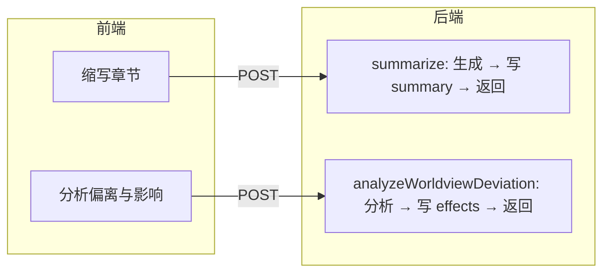

# 章节管理「总结与校验」选项卡 - 前后端 PRD（修订）

## 一、产品概述

### 1.1 目标
在章节管理页的右侧面板中新增一个选项卡「**总结与校验**」，用于对当前选中章节进行**总结**与**一致性校验**。

### 1.2 定位与交互原则
- **主要作用**：总结与校验（缩写章节 + 世界观偏离分析）。
- **触发方式**：两个功能均为**手动触发**（按钮点击）。
- **写库策略（修订）**：用户点击生成后，**后端在生成完成后自动写入数据库，再返回结果**；前端无需再提供「保存为摘要」「保存到章节」按钮，仅展示返回结果并可通过刷新/上下文拿到已写库的 `summary`、`effects`。

### 1.3 用户与前置条件
- 已选择小说且已选择章节；章节有正文（`content` 非空）；分析偏离时章节需已关联世界观（`worldview_id` 有效）。

---

## 二、功能规格（修订：生成后自动写库再返回）

### 2.1 功能一：缩写章节

| 项目 | 说明 |
|------|------|
| **名称** | 缩写章节 |
| **描述** | 基于当前章节正文生成缩短的摘要文本；**后端生成后自动写入 `chapters.summary`，再返回缩写结果**。 |
| **触发** | 用户点击「缩写章节」按钮。 |
| **输入** | 当前章节 ID；可选目标字数（如默认 300）。 |
| **输出** | 缩写文本（即已写入的 `summary` 内容）；前端可直接展示，无需再点保存。 |
| **交互** | 展示 loading；结果展示 + 可复制；若章节无正文则按钮禁用并提示。 |

### 2.2 功能二：分析章节对世界观的偏离程度与影响

| 项目 | 说明 |
|------|------|
| **名称** | 分析章节对世界观的偏离程度与影响 |
| **描述** | 以章节正文与关联世界观设定为输入，分析偏离程度与对世界观/剧情的影响；**后端分析完成后自动写入 `chapters.effects`，再返回分析结果**。 |
| **触发** | 用户点击「分析世界观偏离与影响」按钮。 |
| **输入** | 当前章节 ID（后端取 `content`、`worldview_id` 及世界观内容）。 |
| **输出** | 结构化或 Markdown 形式的结果（即已写入的 `effects` 内容）；前端展示并可复制。 |
| **交互** | 展示 loading；结果展示；若未关联世界观或世界观无内容则按钮禁用并提示。 |

---

## 三、前端 PRD 要点（修订）

### 3.1 页面与入口
- 在 [ChapterCard](src/business/aiNoval/chapterManage/index.tsx) 增加「总结与校验」Tab，`ModuleType` 新增 `'summary-validate'`。

### 3.2 组件与交互
- **ChapterSummaryValidatePanel**：
  - **缩写章节**：长度输入 + 「缩写章节」按钮 → 调后端 → 展示返回的摘要文本（已写库），可复制。
  - **分析偏离与影响**：「分析世界观偏离与影响」按钮 → 调后端 → 展示返回的分析结果（已写库），可复制。
- **不再提供**「保存为摘要」「保存到章节」按钮；保存由后端在生成后自动完成。
- 成功后如需展示「已写入」状态，可依赖章节上下文刷新后读取 `summary`/`effects`，或在接口返回中携带写入后的字段值直接展示。

### 3.3 API 约定（与后端一致）
- **缩写**：`POST /api/aiNoval/chapters/summarize`（或扩展现有 strip 接口）— 入参 `chapterId`、可选 `targetLength`；**后端写库 `summary` 后返回** `{ summary: string }` 或等价。
- **偏离分析**：`POST /api/aiNoval/chapters/analyzeWorldviewDeviation` — 入参 `chapterId`；**后端写库 `effects` 后返回** `{ effects: string }` 或结构化 + 合并为一段写入 effects 后返回同一段文本。

---

## 四、后端 PRD 要点（修订：自动写库再返回）

### 4.1 功能一：缩写章节
- **接口**：如 `POST /api/aiNoval/chapters/summarize`（或统一用现有 strip 路径但增加「写库」行为）。
- **流程**：根据 `chapterId` 取章节 `content` → 调用现有 strip/摘要逻辑（Dify 或 LLM）→ **将结果写入 `chapters.summary`** → **返回** `{ summary }` 或 `{ data: { summary } }`。
- **错误**：章节不存在、无 content 等返回 4xx，不写库。

### 4.2 功能二：分析章节对世界观的偏离与影响
- **接口**：`POST /api/aiNoval/chapters/analyzeWorldviewDeviation`，入参 `chapterId`。
- **流程**：查章节 `content`、`worldview_id` → 拉取世界观内容 → LLM 分析偏离程度与影响 → **将结果（一段 Markdown 或结构化转成的文本）写入 `chapters.effects`** → **返回** `{ effects }` 或等价。
- **错误**：无 `worldview_id`、无 content、世界观无内容等返回 4xx，不写库。

### 4.3 数据与表结构
- 无需改表；使用现有 `chapters.summary`、`chapters.effects` 及 [chaptersService](src/services/aiNoval/chaptersService.js) 的 update 能力。

---

## 五、数据流示意（修订）

---

## 六、实现清单（修订）

**前端**
- 扩展 `ModuleType` 与 ChapterCard，新增「总结与校验」Tab 与 `ChapterSummaryValidatePanel`。
- 缩写：调用 summarize（或扩展 strip）接口，展示返回的 `summary`，可复制。
- 分析：调用 `analyzeWorldviewDeviation`，展示返回的 `effects`，可复制。
- 可选：在面板内展示当前章节已有的 `summary`/`effects` 只读预览（从 context 或接口返回获取）。

**后端**
- **缩写**：在生成摘要后 **先 update chapters.summary，再返回** 该摘要内容（新接口或扩展 strip）。
- **分析**：新接口在 LLM 分析完成后 **先 update chapters.effects，再返回** 该分析内容。
- 统一错误码与错误信息，便于前端禁用按钮与提示。

---

## 七、验收标准（简要）

- 两个功能均为手动触发；**每次触发生成后，后端自动写库再返回**，前端无「保存」按钮。
- 缩写章节：返回内容即已写入的 `summary`，刷新或再次进入可看到章节已有摘要。
- 分析偏离与影响：返回内容即已写入的 `effects`，刷新或再次进入可看到章节已有影响分析。
- 无章节/无正文/无世界观时，对应按钮禁用并有明确提示；接口异常时有统一错误提示。
