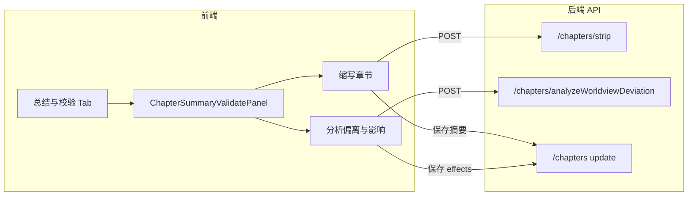

# 章节管理「总结与校验」选项卡 - 前后端 PRD

## 一、产品概述

### 1.1 目标

在章节管理页的右侧面板中新增一个选项卡「**总结与校验**」，用于对当前选中章节进行**总结**与**一致性校验**，不改变现有「事件池管理」「章节骨架」「章节生成」三个选项卡的交互与职责。

### 1.2 定位

- **主要作用**：总结与校验（缩写章节 + 世界观偏离分析）。
- **触发方式**：两个功能均为**手动触发**（按钮点击），无自动轮询或后台任务。

### 1.3 用户与前置条件

- **用户**：使用章节管理的创作者/编辑。
- **前置**：已选择小说且已选择章节；章节有正文内容（`content` 非空）；进行「世界观偏离分析」时，章节需已关联世界观（`worldview_id` 有效）。

---

## 二、功能规格

### 2.1 功能一：缩写章节

| 项目 | 说明 |

|------|------|

| **名称** | 缩写章节 |

| **描述** | 基于当前章节正文，生成一段缩短的摘要文本（缩写），用于快速把握章节要点；用户可选择性将结果保存为章节的「摘要」字段。 |

| **触发** | 用户点击「缩写章节」按钮（或等价操作）。 |

| **输入** | 当前章节 ID；可选：目标字数/长度（如 200～800 字，默认 300）。 |

| **输出** | 缩写后的文本；若用户选择「保存为摘要」，则写入章节的 `summary` 字段并回显。 |

| **交互要点** | 展示加载态；结果可复制；提供「保存为摘要」按钮（写入 `summary` 后刷新章节上下文）。若章节无正文，按钮禁用并提示「请先填写章节内容」。 |

**与现有能力的关系**：

- 现有 [ChapterGeneratePanel](src/business/aiNoval/chapterManage/components/ChapterGeneratePanel.tsx) 内已有「章节缩写」弹窗，调用 `stripChapterBlocking(chapterId, stripLength)`，结果仅展示与复制，**不写入** `summary`。  
- 本功能可在新选项卡内复用同一套「缩写」能力（或共用后端接口），并**增加「保存为摘要」**的流程（前端调用 `updateChapter({ id, summary })` 或后端提供「缩写并保存」接口二选一，见后端章节）。

### 2.2 功能二：分析章节对世界观的偏离程度与影响

| 项目 | 说明 |

|------|------|

| **名称** | 分析章节对世界观的偏离程度与影响 |

| **描述** | 以当前章节正文与章节所关联的世界观设定为输入，分析：① 章节内容相对世界观的**偏离程度**（含简要理由）；② 该章节对世界观/剧情线的**影响**。结果结构化展示，并可选择性保存到章节的「影响/效应」字段。 |

| **触发** | 用户点击「分析世界观偏离与影响」按钮（或等价文案）。 |

| **输入** | 当前章节 ID（后端据此取 `content`、`worldview_id`）；世界观内容由后端按 `worldview_id` 拉取（世界观基础信息 + 可选世界规则等）。 |

| **输出** | 结构化结果，建议包含：偏离程度（如 0–100 分或高/中/低 + 说明）、偏离要点列表、对世界观/剧情的影响描述。若用户选择「保存到章节」，则写入章节的 `effects` 字段并回显。 |

| **交互要点** | 展示加载态（分析可能较慢）；结果以可读形式展示（如 Markdown 或分段）；提供「保存到章节」按钮（写入 `effects` 后刷新）；若章节未关联世界观或世界观无内容，按钮禁用并提示。 |

**数据与类型**：

- 章节已有 [IChapter](src/types/IAiNoval.ts) 的 `summary`、`effects`；[chaptersService](src/services/aiNoval/chaptersService.js) 已包含 `summary`、`effects` 列，无需改表。  
- 世界观内容来源：现有 [IWorldViewData](src/types/IAiNoval.ts) 的 `content`；若需更细粒度规则，可沿用 [brainstorm/analyze](pages/api/web/aiNoval/brainstorm/analyze.ts) 中通过 MCP/ReAct 拉取 worldbook、world_state、faction 等的方式，或简化为仅世界观基础 content + 世界规则快照文本。

---

## 三、前端 PRD 要点

### 3.1 页面与入口

- **位置**：章节管理页右侧卡片 [ChapterCard](src/business/aiNoval/chapterManage/index.tsx) 内，与「事件池管理」「章节骨架」「章节生成」并列的 Tab。
- **新增**：一个 Tab 项「**总结与校验**」，对应 `ModuleType` 新增取值 `'summary-validate'`（或 `'chapter-summary-validate'`）。

### 3.2 组件结构建议

- **新增面板组件**：如 `ChapterSummaryValidatePanel.tsx`，作为「总结与校验」Tab 下唯一内容。
- **职责**：  
  - 展示当前章节的只读信息（章节号、标题、版本、是否已存在 `summary`/`effects` 的简要状态）。  
  - **功能一**：缩写章节区域（可选长度输入 + 「缩写章节」按钮 + 结果展示 + 「保存为摘要」按钮）。  
  - **功能二**：世界观偏离分析区域（「分析世界观偏离与影响」按钮 + 结果展示 + 「保存到章节」按钮）。  
- **状态**：两个功能各自 loading、结果内容、错误信息；是否已保存到 `summary`/`effects` 可由 `useChapterContext` 的章节数据或 refetch 后得到。

### 3.3 与现有能力复用

- **缩写**：可复用 `stripChapterBlocking(chapterId, stripLength)`；若后端提供「缩写并保存摘要」接口，则改为调用新接口并在成功后刷新章节。  
- **章节数据**：通过 `useChapterContext()` 获取当前章节；保存摘要/影响后调用 `updateChapter`，并触发章节上下文刷新（与 [apiCalls](src/business/aiNoval/chapterManage/apiCalls.ts) 中现有 `updateChapter` 一致）。  
- **世界观**：当前章节的 `worldview_id` 来自章节上下文；若需展示世界观名称等，可复用 `WorldViewContext` 的 `worldViewData` 或 `getWorldViewById`。

### 3.4 交互与校验

- 未选章节或章节无 `content`：缩写按钮禁用并提示。  
- 未选章节或章节无 `worldview_id` / 世界观无内容：偏离分析按钮禁用并提示。  
- 两个功能均需明确 loading 与错误态（如 message.error / 结果区展示错误信息）。  
- 保存成功后：可 message.success，并刷新章节数据（以便左侧列表或其它 Tab 看到最新 `summary`/`effects`）。

### 3.5 API 调用（前端需对接）

- **缩写**：沿用 `POST /api/aiNoval/chapters/strip`（或新接口，见后端）；若后端不提供「保存摘要」，则前端在拿到缩写结果后调用 `updateChapter({ id, summary })`。  
- **世界观偏离分析**：新接口，如 `POST /api/aiNoval/chapters/analyzeWorldviewDeviation`，入参 `chapterId`，返回结构化结果；保存时前端调用 `updateChapter({ id, effects })`。

---

## 四、后端 PRD 要点

### 4.1 功能一：缩写章节

- **方案 A（推荐，改动最小）**：  
  - 继续使用现有 [strip API](pages/api/web/aiNoval/chapters/strip.ts)：入参 `chapterId`、`stripLength`（可选），返回缩写文本。  
  - 前端负责：将得到的缩写文本通过现有 `updateChapter` 写入 `summary`。  
- **方案 B**：  
  - 新增接口，如 `POST /api/aiNoval/chapters/summarize`：入参 `chapterId`、可选 `targetLength`。  
  - 后端逻辑：调用现有 strip 逻辑（或同一 Dify workflow / 同一 LLM 摘要逻辑），将结果写入 `chapters.summary` 并返回最新摘要。  
  - 便于以后做「仅服务端可写 summary」的权限或审计，但需重复一部分 strip 逻辑或封装共用。

**建议**：首版采用方案 A；若产品后续要求「仅后端可写 summary」或需要审计日志，再增加方案 B。

### 4.2 功能二：分析章节对世界观的偏离程度与影响

- **新接口**：如 `POST /api/aiNoval/chapters/analyzeWorldviewDeviation`（或 `analyzeWorldview`）。  
- **入参**：`chapterId`（必填）。  
- **后端流程**：  

  1. 根据 `chapterId` 查询章节：取 `content`、`worldview_id`；若无 `worldview_id` 或 `content` 为空，直接返回 400 及明确错误信息。  
  2. 根据 `worldview_id` 获取世界观内容：至少包含世界观基础 `content`（如 worldView 表或现有 worldview 接口）；可选：拉取世界规则快照、时间线等（可参考 [brainstorm/analyze](pages/api/web/aiNoval/brainstorm/analyze.ts) 的 MCP/ReAct 或简化版仅用 worldview 文本）。  
  3. 调用 LLM：输入为「章节正文 + 世界观设定」，输出为结构化结果（见下）。  
  4. 返回 JSON：如 `{ deviationScore?, deviationLevel?, deviationReasons?, impactDescription? }` 或一段 Markdown（由前端原样展示）；不自动写库，由前端在用户点击「保存到章节」时调用 `updateChapter({ id, effects })`。  

- **输出结构建议**（便于前端展示与保存）：  
  - `deviationScore`：0–100 的偏离度分数（可选）。  
  - `deviationLevel`：高/中/低（可选）。  
  - `deviationReasons`：偏离要点列表或一段文本。  
  - `impactDescription`：对世界观/剧情的影响描述。  
  - 或统一为一段 **Markdown 文本**，包含「偏离程度」「偏离要点」「影响分析」等标题，后端只返回该文本，前端展示并整段写入 `effects`。  

- **实现参考**：  
  - Prompt 可参考 [brainstorm/analyze](pages/api/web/aiNoval/brainstorm/analyze.ts) 的「影响分析」「一致性检查」部分，改为「章节 vs 世界观」的对比分析。  
  - 若需更强一致性，可引入 MCP 工具（worldbook、world_state、faction 等）拉取更多设定后再分析；首版也可仅用 worldview 的 `content` + 世界规则文本以降低复杂度。

### 4.3 数据与权限

- **表结构**：无需变更；`chapters.summary`、`chapters.effects` 已存在且已在 [chaptersService](src/services/aiNoval/chaptersService.js) 的 validColumns 中。  
- **写库**：摘要写入由前端 `updateChapter` 完成（方案 A），或后端 summarize 接口写入（方案 B）；偏离分析结果仅读库不写库，写 `effects` 由前端 `updateChapter` 完成。  
- **权限**：与现有章节更新接口一致（若现有有鉴权，新接口与现有保持一致）。

### 4.4 错误与限流

- 章节不存在、无 `worldview_id`、无 `content`、世界观不存在或无内容：返回 4xx 及明确文案。  
- LLM/外部服务超时或失败：返回 5xx 或 200 + 业务错误码，前端统一提示「分析失败，请稍后重试」。  
- 若单次分析耗时较长，可考虑设置合理 timeout（如 60s）并在前端做 loading 与超时提示。

---

## 五、数据流示意

---

## 六、实现清单（供开发排期）

**前端**

- 在 [index.tsx](src/business/aiNoval/chapterManage/index.tsx) 中扩展 `ModuleType`，增加「总结与校验」Tab 及对应 `renderModuleContent` 分支。  
- 新增 `ChapterSummaryValidatePanel` 组件：缩写区域（长度 + 按钮 + 结果 + 保存为摘要）、偏离分析区域（按钮 + 结果 + 保存到章节）。  
- 在 [apiCalls](src/business/aiNoval/chapterManage/apiCalls.ts) 中新增 `analyzeChapterWorldviewDeviation(chapterId)`（若后端路径不同则按实际命名）。  
- 保存摘要/影响后触发章节数据刷新（与现有 updateChapter 后刷新逻辑一致）。

**后端**

- 保持现有 strip 接口不变（或按需增加 summarize 接口）。  
- 新增 `analyzeWorldviewDeviation` 接口：查章节与世界观、组 prompt、调 LLM、返回结构化或 Markdown 结果。  
- 错误码与错误信息统一，便于前端展示。

---

## 七、验收标准（简要）

- 章节管理右侧可切换到「总结与校验」Tab，且仅在有选中章节时展示两个功能区。  
- 缩写章节：点击后得到缩写文本，可复制；可一键保存为章节摘要并在再次打开时能看到已保存摘要状态。  
- 分析偏离与影响：点击后得到偏离程度与影响分析，可复制；可一键保存到章节影响字段并在再次打开时能看到已保存。  
- 无章节/无正文/无世界观时，对应按钮禁用并有明确提示；接口异常时前端有统一错误提示。